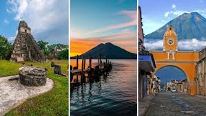
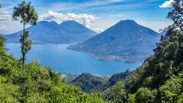
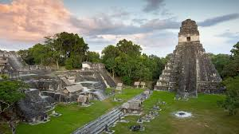
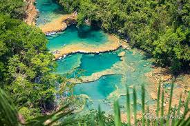
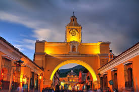
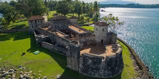
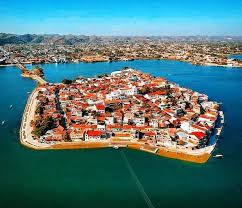
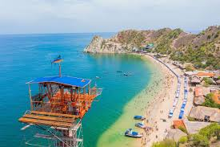

<HTML>
<HEAD>
<TITLE> Lugares Turisticos de Guatemala </TITLE>

</HEAD>
<BODY bgcolor="e7fdd2">
<PRE>

 </img>

Lugares Turísticos de Guatemala 

Guatemala en la lengua <i>náhuatl</i> significa “lugar de muchos árboles”, una descripción más que acertada para este paraíso
 de Centroamérica. Cuando un turista viaja a este país y se pregunta <b>qué lugares turísticos de Guatemala visitar</b>, 
la respuesta no es sencilla. Guatemala tiene playa, tiene cultura colonial y tiene mucho de sus raíces mayas. 

Estos son los mejores lugares turísticos de Guatemala

<ul type=circle>
<li>Lago de Atitlán

<li>Tikal y Petén

<li>Semuc Champey

<li>Antigua Guatemala

<li>Castillo de San Felipe

<li>Isla de Flores

<li>Playa Blanca

</ul>

<marquee behavior="scroll">Lago de Atitlán</marquee>

Es el cuerpo de agua más grande de Guatemala. Su parte más profunda se encuentra a 325 metros aproximadamente,
 mientras la profundidad media es de 220 metros. En realidad, esto lo convierte en el lago más profundo de Centroamérica.
 Alrededor del lago encontrarás más de 11 pueblos coloridos, con distintos mercados, museos, actividades extremas, hoteles
 lujosos y mucho más.

<ul type=circle>
<li><u><b>Precios:</b></u>
Hospedaje desde Q100.00 la noche

<li><u><b>Horario:</b></u>
Preferiblemente visitar desde muy temprano

<li><u><b>Ubicación</b></u>
Departamento de Sololá, Guatemala
</ul>
 

 </img>

<marquee behavior="scroll">Tikal y Petén</marquee>

El Parque Nacional de Tikal alberga las joyas más importantes de la civilización Maya en Guatemala. Tikal está repleto
 de restos arqueológicos y fue declarado Parque Nacional en 1955 y sitio de <b> Patrimonio Mundial</b> por la Unesco 
en 1979. Cuenta con 576 kilómetros de selva y es utilizado como santuario de los sacerdotes mayas contemporáneos.

<ul type=circle>
<li><u><b>Precios:</b></u>
Turistas nacionales: Q25.00 | Turistas extranjeros: Q150.00

<li><u><b>Horario:</b></u>
Lunes a domingo de 6:00 a.m. a 6:00 p.m.

<li><u><b>Ubicación</b></u>
Departamento de Petén, Guatemala
</ul>
 

 </img>

<marquee behavior="scroll">Semuc Champey</marquee>

Semuc Champey es sin duda alguna uno de los destinos más conocidos de Guatemala. Ocupa una especie de puente natural,
 alrededor de 300 metros de largo en los que hay lagunas con profundidades de uno hasta cuatro metros. Es posible nadar en 
sus aguas cristalinas y disfrutar de la naturaleza.

<ul type=circle>
<li><u><b>Precios:</b></u>
Adultos Q30.00 | Niños Q10.00 | Extranjeros Q50.00 | Camping Q10.00 | Parqueo Q10.00

<li><u><b>Horario:</b></u>
Visitar preferiblemente desde muy temprano

<li><u><b>Ubicación</b></u>
Lanquín, departamento de Alta Verapaz, Guatemala
</ul>
 

 </img>

<marquee behavior="scroll">Antigua Guatemala</marquee>

La Antigua Guatemala es uno de los destinos turísticos más visitados del país gracias a su gran historia colonial. En este destino es
 posible caminar sobre calles de piedras, rodeado de casas de colores, parques y muchos espacios repletos de historia.
 Destacan destinos como la Calle del Arco, el Cerro de La Cruz, el parque central,mercados, museos y mucho más.

<ul type=circle>
<li><u><b>Precios:</b></u>
Hospedaje desde Q100.00 la noche

<li><u><b>Ubicación</b></u>
Departamento de Sacatepéquez, Guatemala
</ul>
 

 </img>

<marquee behavior="scroll">Castillo de San Felipe</marquee>

Este castillo ubicado en el departamento de Izabal es conocido como uno de los destinos más interesantes por su historia. 
El Castillo de San Felipe fue construido durante el siglo XVI en Guatemala para proteger las propiedades coloniales contra los
 ataques de los piratas. En la actualidad, puedes recorrer sus pasillos, subir a sus miradores y observar toda la naturaleza que lo rodea.

<ul type=circle>
<li><u><b>Precios:</b></u>
Q25.00 guatemaltecos | Q75.00 extranjeros

<li><u><b>Horario:</b></u>
Lunes a domingo de 8:00 a.m. a 4:00 p.m.

<li><u><b>Ubicación</b></u>
Lago de Izabal, Río Dulce, Izabal
</ul>
 

 </img>

<marquee behavior="scroll">Isla de Flores</marquee>

Si quieres salir de la rutina en uno de los destinos más paradisíacos de Guatemala, sin duda conocer la Isla de Flores es una
 excelente opción. Este sitio se caracteriza por sus terrazas con vista y restaurantes de comida gourmet. El ambiente de la isla es 
alegre, con un clima agradable y una vista increíble.

<ul type=circle>
<li><u><b>Precios:</b></u>
Hospedaje desde Q150.00 la noche

<li><u><b>Ubicación</b></u>
Isla de Flores, Departamento de Petén
</ul>
 

 </img>

<marquee behavior="scroll">Playa Blanca</marquee>

Se trata de una pintoresca playa ubicada en el Atlántico, tiene la peculiaridad de tener arena blanca y aguas turquesas.
 En Playa Blanca no cuentan con construcciones ni restaurantes, con la finalidad de mantener la playa limpia. Para 
llegar a este destino necesita tomar una lancha desde Livingston o Río Dulce y se tarda aproximadamente una hora.

<ul type=circle>
<li><u><b>Precios:</b></u>
Entrada a la playa Q30.00 por persona

<li><u><b>Horario:</b></u>
Lunes a domingo de 8:00 a.m. a 5:00 p.m.

<li><u><b>Ubicación</b></u>
Viaje en lancha desde Puerto Barrios, departamento de Izabal
</ul>
 

 </img>

Para más información a continuación se mencionan algunas agencias de viaje:

<a href="https://www.tripadvisor.es/Attractions-g292006-Activities-c42-t235-Guatemala_City_Guatemala_Department.html"> </img></a>   <a href="https://www.viajestivoli.com/"> </img></a>   <a href="https://www.getyourguide.es/-l169110/?cmp=ga&cq_src=google_ads&cq_cmp=16383735752&cq_con=131045364902&cq_term=paquetes%20turisticos%20en%20guatemala&cq_med=&cq_plac=&cq_net=g&cq_pos=&cq_plt=gp&campaign_id=16383735752&adgroup_id=131045364902&target_id=kwd-298951396945&loc_physical_ms=9069795&match_type=b&ad_id=617845726504&keyword=paquetes%20turisticos%20en%20guatemala&ad_position=&feed_item_id=&placement=&device=c&partner_id=CD951&gad_source=1&gclid=CjwKCAjwxNW2BhAkEiwA24Cm9KbsttUoUmZKP-McXZElzbahjKswOVgu4aaRtJ0WM32XcXXMTeD2QxoCwTAQAvD_BwE"> </img></a>

